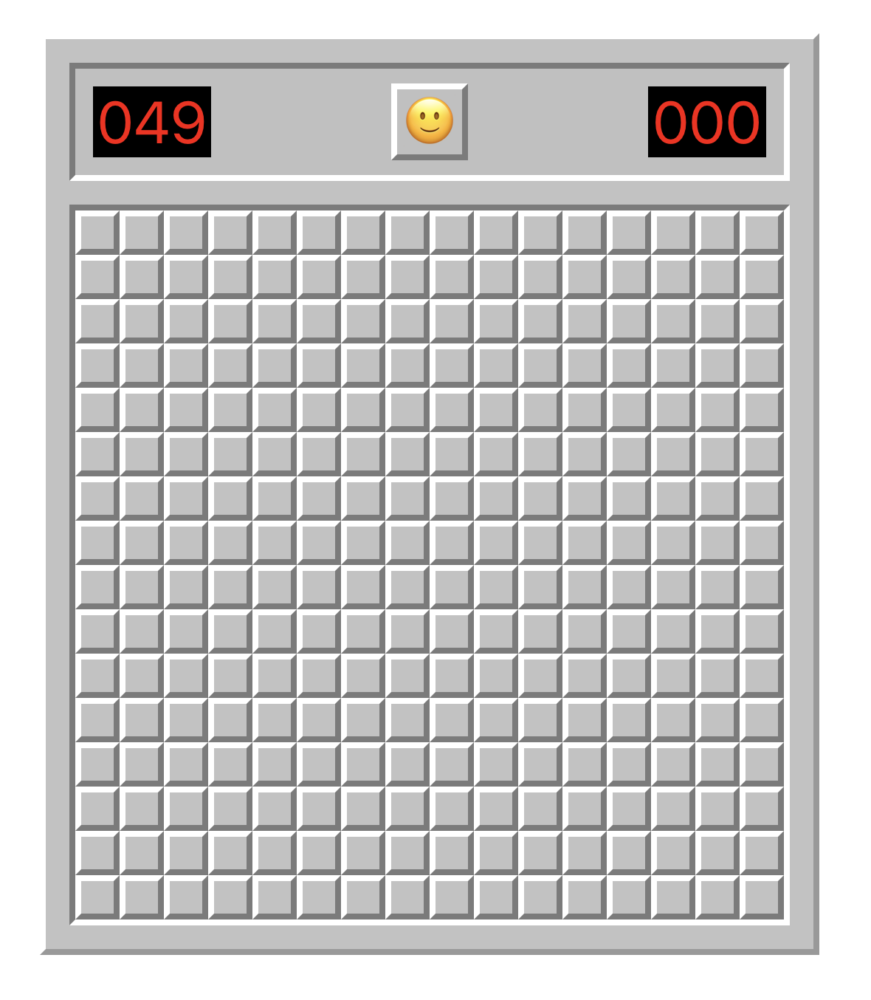
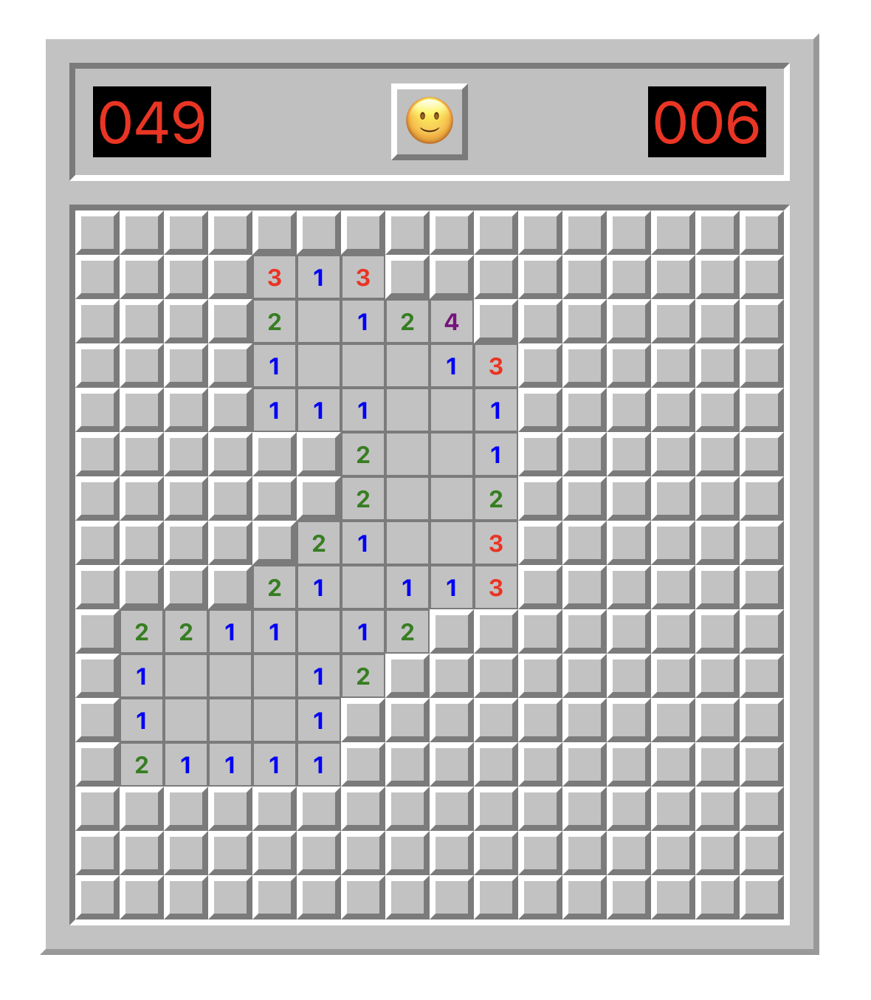
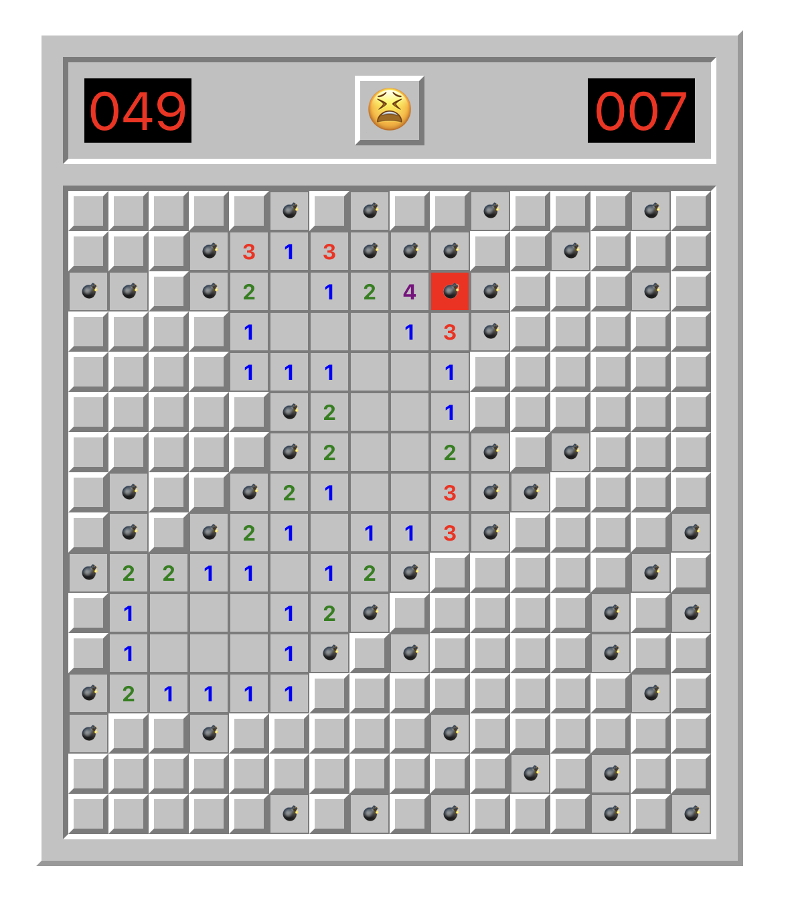
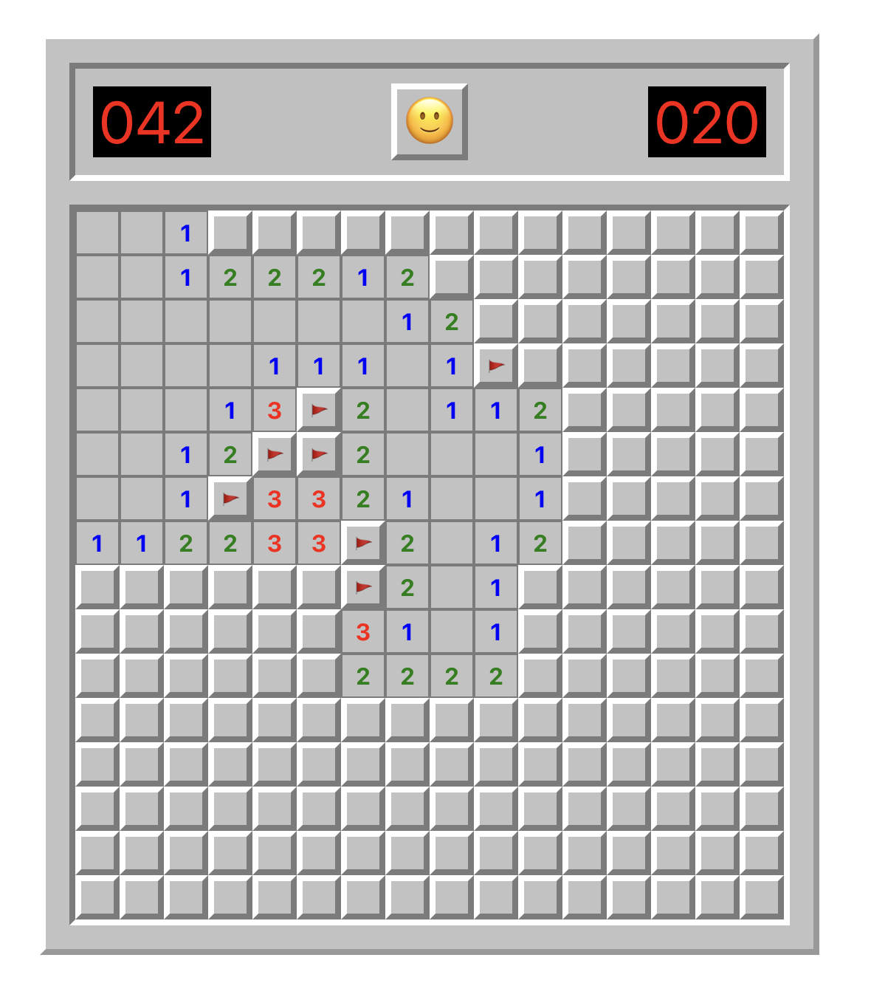

# ⛏️MineSweeper⛏️

A clone of minesweeper using react, typescript and scss.

## run and test

- command -> npm start

- **Start the game**

  

- **The first click is guaranteed to be a space**

  

- **The bomb is marked red when you click on it**

  

- **Put flags on the bomb**

  

